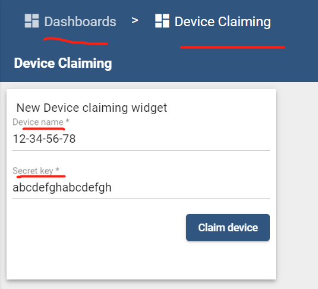

| Supported Targets | ESP32 | ESP32-C2 | ESP32-C3 | ESP32-H2 | ESP32-S3 |
| ----------------- | ----- | -------- | -------- | -------- | -------- |

# Claiming Device - ThingsBoard MQTT Client 示例

* [English Version](./README.md)

本示例基于 [`$ESP-IDF\examples\protocols\mqtt\tcp`](https://github.com/espressif/esp-idf/tree/master/examples/protocols/mqtt/tcp).

本示例实现了 认领设备 相关功能：

* 发送认领设备消息到服务器:
  * Topic: `v1/devices/me/claim`
  * Payload: `{"secretKey":"value", "durationMs":60000}`

**注意**: 参考 [Claiming devices API](https://thingsboard.io/docs/reference/mqtt-api/#claiming-devices)

## 硬件需求

* 一个载有 ESP32/ESP32-C3/ESP32-H2/ESP32-C2/ESP32-S3 SoC 的开发板(例如, ESP32-DevKitC, ESP-WROVER-KIT 等等)
* 一条用于供电与编程的 USB 线

参考 [Development Boards](https://www.espressif.com/en/products/devkits) 获得更多信息.

## 如何使用例子

1. 获取 Access token

   `Login in ThingsBoard CE/PE` --> `Devices` --> 单击选择我的设备 --> `Details` --> `Copy Access Token`.


1. 设定 Target (optional)

   在项目 configuration 与 build 之前, 请务必使用设置正确的芯片目标:

   ```bash
   idf.py set-target <chip_name>
   ```

1. 编译配置 menuconfig

   项目 configuration:

   ```bash
   idf.py menuconfig
   ```

   配置以下选项 ThingsBoard MQTT URI, access token, Wi-Fi SSID, password:

   ```menuconfig
   Example Configuration  --->
       (mqtt://MyThingsboardServerIP) Broker URL
       (MyDeviceToken) Access Token 
   Example Connection Configuration  --->
       [*] connect using WiFi interface
       (MySSID) WiFi SSID 
       (MyPassword) WiFi Password                  
   Component config  --->
       ThingsBoard MQTT Client library (TBMQTTClient)  ---> 
           [*] Enable TBMQTTClient Helper
   ```

1. 编译与运行 build, flash and monitor

   运行 `idf.py -p PORT flash monitor` 来编译、烧录、监控项目.

   (如果要退出串口监控，请输入 ``Ctrl-]``.)

   有关配置和使用 ESP-IDF 构建项目的完整步骤，请参阅 [入门指南](https://idf.espressif.com/)。

1. 在 ThingsBoard 上为认领设备而创建一个 dashboard

   参考 [这里](https://thingsboard.io/docs/user-guide/claiming-devices/#device-claiming-widget).

   * 创建一个 dashboard: `Dashboards` --> `+` Add Dashboard --> `Create new dashboard` --> Title: `Device Claiming` --> `Add`.

   * 添加认领设备控件: `Dashboards` --> Click `Device Claiming` --> `Open dashboard` --> `Enter edit mode` --> `Add new widget` --> `Input widgets` --> `Device Claiming widget` --> `Add` --> `Apply Changes`.

      

## 日志输出

```none
...
0x40081188: call_start_cpu1 at C:/Espressif/frameworks/esp-idf-v4.4.1/components/esp_system/port/cpu_start.c:160

I (0) cpu_start: App cpu up.
I (459) cpu_start: Pro cpu start user code
...
I (28033) SERVER_RPC_EXAMPLE: Disconnect tbmch ...
I (28033) tb_mqtt_client_helper: disconnecting from mqtt://192.168.0.186...
W (28143) MQTT_CLIENT: Client asked to stop, but was not started
I (28243) SERVER_RPC_EXAMPLE: Destroy tbmch ...
I (28243) tb_mqtt_client_helper: It already disconnected from thingsboard MQTT server!
```

## 故障排除

如有任何技术问题，请打开 [issue](https://github.com/liang-zhu-zi/esp32-thingsboard-mqtt-client/issues)。 我们会尽快回复您。
